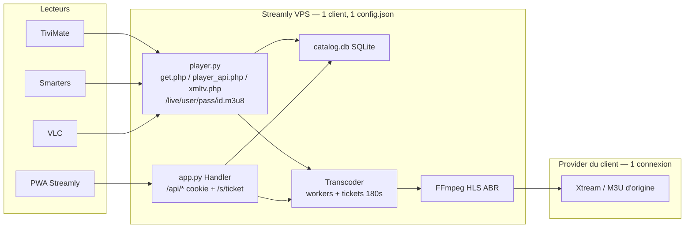
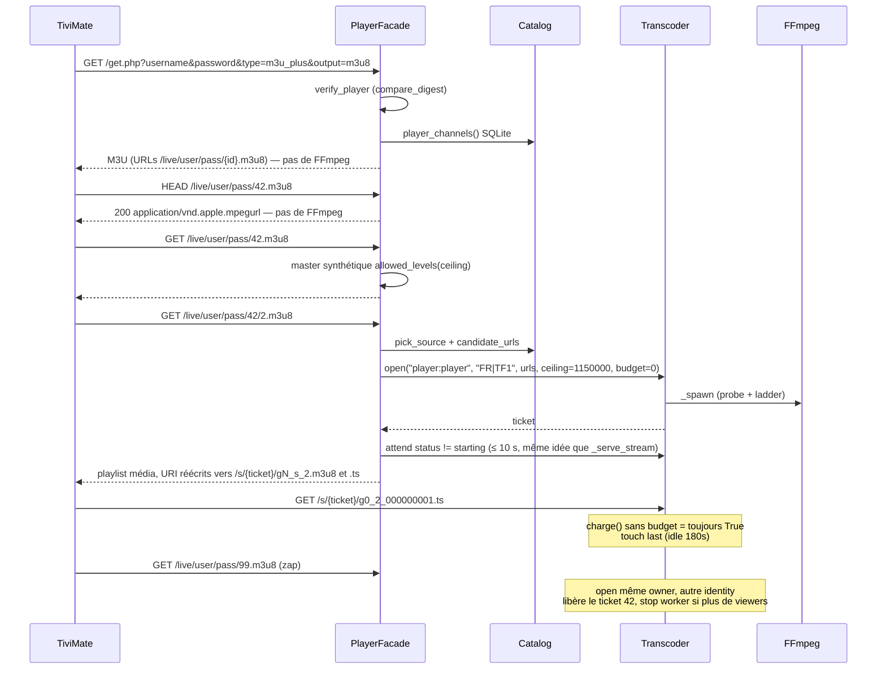
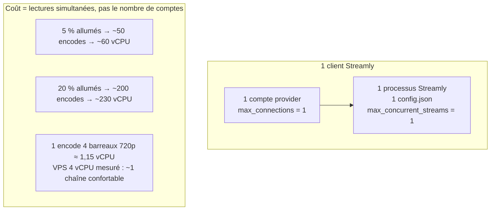

# Façade lecteur Xtream / M3U — Streamly comme tuyau compressé ABR

| Champ | Valeur |
|---|---|
| **Document** | Design — façade player (TiviMate / IPTV Smarters / VLC) |
| **Auteur** | Streamly maintainers |
| **Date** | 2026-09-18 |
| **Statut** | Validé, révisé le 2026-09-19 après relecture (voir « Révision ») |
| **Périmètre code** | `server/streamly/app.py`, `transcoder.py`, `auth.py`, `catalog.py`, `config.py`, `web/app.js`, `web/index.html`, `deploy/adduser.py`, `tests/test_streamly.py` |
| **Hors périmètre immédiat** | VOD/séries vers lecteurs externes, ordonnanceur multi-tenant, GPU, flotte 1 000 instances |

---

## Révision du 2026-09-19

La relecture contre le code a corrigé quatre points qui auraient cassé la lecture réelle. Ils **priment** sur le reste du document ; les sections concernées sont amendées plus bas.

| # | Problème dans le draft | Correction retenue |
|---|---|---|
| R1 | Tous les appareils d'un compte partagent l'owner `player:{user}`, et `open` libère les autres tickets du même owner. Deux appareils sur deux chaînes se chassent à chaque rafraîchissement de playlist (2 s) : FFmpeg redémarre en boucle sur l'unique connexion du fournisseur. Un scan des playlists média provoque N lancements, pas « 1 lancement puis des 503 ». | Une playlist média ne rouvre une chaîne **que** si le master de cette chaîne vient d'être demandé (intention fraîche, consommée à l'ouverture), ou si le compte n'a plus aucune lecture en cours (simple expiration). Un appareil évincé reçoit une erreur au lieu de reprendre la main. Plus un délai d'environ 1 s après le master : si une autre chaîne a été demandée entre-temps, on n'ouvre pas. |
| R2 | Décision 11 : en passthrough, seul le niveau 0 existe ; le master synthétique annonce 1, 2, 3 → trois 404, aucun repli, la chaîne ne se lit pas. | En passthrough, la façade sert la playlist `s_0` quel que soit le niveau demandé. |
| R3 | Sans `-start_number`, chaque génération (bascule de source, ajout de barreaux) repart à la séquence 0. Le web se réattache via `/api/playback` ; TiviMate/VLC voient une séquence qui recule et se figent. | `-start_number` = horloge Unix (strictement croissant d'une génération à l'autre) et `#EXT-X-DISCONTINUITY-SEQUENCE:{génération}` dans la playlist média servie par la façade. |
| R4 | `Sessions.attempts` compte par `client_address` : derrière Apache tout vient de `127.0.0.1`, dix essais de robots bloquent tout le monde cinq minutes. | `X-Forwarded-For` (dernière entrée, celle ajoutée par Apache) n'est cru que si `listen_host` est local **et** que la requête vient de la boucle locale. Même règle pour `X-Forwarded-Proto/Host`. |

Autres ajustements :

- **Comptes lecteurs en liste** (`players: [...]`) dès la v1, même avec un seul élément : pas de migration de config le jour où Streamly sert plusieurs utilisateurs.
- **Mot de passe de 12 caractères** sans 0/o/1/l (alphabet de 31 signes, ~59 bits) : il se tape à la télécommande. La limite de tentatives rend la force brute impraticable.
- **`public_url`** optionnel dans la config ; sinon l'adresse est déduite de la requête. Le modèle Apache pose `X-Forwarded-Proto: https`, qu'Apache n'envoie pas de lui-même.
- **Catalogues compressés en gzip** si le lecteur l'accepte : mesuré sur le vrai catalogue (23 837 chaînes), le M3U passe de 5,2 Mo à 0,58 Mo et le JSON `get_live_streams` de 7,5 Mo à 0,57 Mo. L'index se construit en 0,14 s.
- **Coût CPU** : le « 1,15 vCPU par chaîne » date d'avant l'encodage des seuls barreaux utiles (commit `358a6e3`). En `balanced`, 3 barreaux sur 4 ; en `eco`, 2. Le tableau d'échelle est pessimiste, à remesurer.
- **HTTPS** reste hors périmètre du code, mais c'est un **prérequis** avant de donner des identifiants à d'autres utilisateurs : ils figurent dans l'URL du master.
- **Découpage en 3 étapes** au lieu de 7 PR (voir « Plan de livraison »).

---

## Overview

Streamly est aujourd’hui un **lecteur web**. Le navigateur appelle `POST /api/play`, reçoit un ticket, et lit `GET /s/{ticket}/master.m3u8` — une vraie playlist HLS ABR (barreaux 720/480/360/240) produite à la demande par FFmpeg. Les utilisateurs ont déjà TiviMate, IPTV Smarters ou VLC : ils ne veulent pas d’un second lecteur, ils veulent coller des identifiants Streamly dans l’app qu’ils connaissent et recevoir **le même tuyau compressé adaptatif**.

Ce document propose une **façade HTTP compatible Xtream Codes / M3U** (`get.php`, `player_api.php`, `xmltv.php`, `/live/{user}/{pass}/{id}.m3u8`) qui s’appuie sur le catalogue SQLite et sur `Transcoder.open` existants. L’encodage reste paresseux : FFmpeg ne démarre que lorsqu’un lecteur ouvre réellement une chaîne (GET d’une playlist média ou d’un segment), jamais pour un dump de catalogue, un HEAD, ou un `player_api.php?action=get_live_streams`. Une instance dédiée, un spectateur, une chaîne live. L’échelle 1 000 comptes est un modèle de flotte, pas cette série de PR.

---

## Background & Motivation

### État actuel

Le chemin de lecture live est entièrement pensé pour le navigateur :

1. Session cookie HttpOnly (`streamly_session`) via `Sessions.login` (`server/streamly/auth.py`).
2. `POST /api/play` (`Handler._api_post` dans `server/streamly/app.py`) : `Catalog.pick_source(lang, canonical, preferred_source_height)` puis `Transcoder.open(session_id, lang|canonical, candidate_urls, …, ceiling, budget)`.
3. Le client lit `/s/{ticket}/master.m3u8`. **Aucun cookie n’est exigé sur `/s/`** : le ticket *est* l’authentification média (`Handler._serve_stream`).
4. Un même `identity` (hash SHA-256 tronqué, clé worker) partage un FFmpeg entre tickets. Un même `owner` ne garde qu’une chaîne : `Transcoder.open` libère les tickets stale du propriétaire (`transcoder.py`, commentaire « Un meme appareil ne regarde qu’une chaine a la fois »).
5. Idle ticket **180 s** (constante dans `ticket()` / `_expire_locked`, distincte de `idle_timeout_seconds: 120` dans `config.example.json`, aujourd’hui non lue).
6. Capacité : `max_concurrent_streams` (exemple : 2) **et** `providers[].max_connections` (exemple : 1). `CapacityError` → HTTP 409 sur `/api/play`.

Les lecteurs tiers **ne peuvent pas** coller un cookie HttpOnly dans une URL Xtream. Ils envoient `username` / `password` en query (`get.php?username=&password=`) ou dans le chemin (`/live/user/pass/id.m3u8`). Le jeton admin ne doit jamais y figurer (déjà un invariant README : « Les URLs live portent un ticket de lecture, jamais le jeton administrateur »).

### Douleur produit

Sans façade, Streamly n’est pas une « souscription compressée » : c’est une PWA. L’utilisateur mobile qui zappe dans TiviMate tire le débit source (~2,5–4 Go/h mesurés, `docs/mesures.md`) au lieu des barreaux 240p–720p. Le mode Économie / Équilibré / Sport du web n’existe pas pour VLC. Le mode Budget (plafond d’octets, HTTP 402) **ne se mappe pas** : TiviMate n’a pas de compteur Mo Streamly.

### Art antérieur (déjà analysé, non ré-ouvert)

| Projet | Ce qu’on reprend | Ce qu’on refuse |
|---|---|---|
| Dispatcharr, tuliprox, iptv-proxy, XtreamFilter | Formes `player_api.php` / `get.php` / `xmltv.php` / `/live/user/pass/id.m3u8` ; utilisateur « streamer » sans UI admin | TS à un seul débit comme sortie unique ; fusion de comptes provider |
| Dispatcharr output profiles, tuliprox `share_live_streams`, m3u-proxy | FFmpeg éphémère à la consommation ; plafond de sortie = filtre d’échelle | 1 pull provider partagé entre *clients* distincts |
| XC_VM, Eyevinn, Livetran | — | Encode unique d’origine pour des milliers de spectateurs ; ingest OBS/SRT |

Contrainte métier non négociable : **chaque client a son propre compte mega-OTT / Xtream (souvent 1 connexion)**. Streamly ne fusionne jamais ces identifiants. Sur l’instance dédiée d’aujourd’hui, les `providers[]` appartiennent à *ce* client ; le failover inter-providers de `State.candidate_urls` reste légitime. À 1 000 clients, 1 000 configs, jamais une config partagée.

---

## Goals & Non-Goals

### Goals (v1)

- Exposer une façade **live** consommable par TiviMate, IPTV Smarters et VLC : M3U (`get.php`) **et** Xtream (`player_api.php`) dès le premier livrable.
- Sortie **HLS ABR** (`master.m3u8` + barreaux), jamais un MPEG-TS à débit fixe.
- Démarrer FFmpeg **uniquement** à l’ouverture réelle d’une chaîne ; arrêter via l’idle ticket 180 s déjà en place.
- Identifiants lecteur **dédiés**, distincts du jeton admin / cookie de session.
- Réutiliser `Transcoder.open` / `master_playlist` / `_serve_stream` / `pick_source` / `candidate_urls`.
- Page Réglages : bloc copy-paste (hôte, user, mot de passe, URL M3U). Le rôle `viewer` peut le *voir*.
- Une instance, un spectateur, une chaîne. Documenter le modèle 1 000 sans l’implémenter.
- Tests unittest dans `tests/test_streamly.py` (même style que `HTTPTests` / `WorkerTests`).

### Non-Goals (v1)

- VOD et séries vers les lecteurs externes (`/media/{job}/` exige déjà un cookie ; préparation asynchrone incompatible avec `get_vod_streams` « clique et ça joue »).
- Mode Budget (cap d’octets, HTTP 402) dans TiviMate / VLC.
- Pré-encodage du bouquet, workers GPU, scheduler multi-tenant, fusion de pulls entre clients.
- Remplacer le lecteur web ; il reste l’outil d’admin, de synchro et de réglages.
- Écrire ou versionner `server/config.json`, le catalogue, ou des secrets.
- Changer `max_concurrent_streams` par défaut (l’opérateur d’une box 1 connexion le mettra à 1).
- HTTPS obligatoire dans ce chantier (le README le décrit déjà ; la façade le rend *plus* urgent, elle ne le livre pas).

---

## Key Decisions

1. **Streamly n’est pas le lecteur ; la façade est un contrat Xtream/M3U par-dessus le transcodeur existant.**  
   Rationale : TiviMate/Smarters/VLC restent. On n’invente pas un second pipeline HLS. `POST /api/play` reste le chemin web.

2. **v1 livre M3U *et* Xtream, live uniquement.**  
   Rationale : TiviMate accepte les deux ; Smarters est Xtream-natif. Un livrable M3U-only forcerait une seconde passe UI/tests pour le même catalogue. VOD/séries : tableaux vides, pas d’erreur.

3. **Identifiants lecteur = liste `players` dans `config.json` (clair, `chmod 600`), pas le jeton admin.** *(Révision : liste, pas un bloc unique.)*  
   Rationale : l’UI doit réafficher user + mot de passe + URL M3U. `users[]` PBKDF2 (200 000 itérations) est trop cher sur chaque segment `/live/user/pass/...`. Le motif existe déjà : `token` / `viewer_token` en clair dans le fichier privé. Vérification `hmac.compare_digest` + rate-limit 10 / 5 min de `Sessions.attempts`.

4. **Owner des tickets = `player:{username}`, identity worker = `lang|canonical` (identique au web).**  
   Rationale : le zap libère déjà l’ancienne chaîne (`Transcoder.open` lignes 489–496). **Révision R1** : cette libération ne doit être déclenchée que par une intention fraîche (GET du master), jamais par le simple rafraîchissement d’une playlist média. Web et TiviMate sur la *même* chaîne partagent le worker (clé = hash d’identity), ce qui est correct sur une box dédiée. On ne partage pas entre *clients* : un client = une instance = un `config.json`.

5. **URL de chaîne stable `/live/{user}/{pass}/{id}.m3u8` ; ticket interne, jamais 302 durable.**  
   Rationale : un 302 vers `/s/{ticket}/master.m3u8` ferait mémoriser un ticket de 180 s à TiviMate. Le master servi sur l’URL stable réécrit les URI des variantes en chemins `/s/{ticket}/…` (déjà sans cookie). Relance = nouvel `open` sur la même URL stable.

6. **FFmpeg ne démarre pas sur HEAD, ni sur `get.php` / `player_api.php` / `xmltv.php`.**  
   Le GET du **master** d’une chaîne ne spawn **pas** non plus : playlist maître **synthétique** (barreaux du plafond). Le GET d’une **playlist média** (`…/{id}/{level}.m3u8`) ou d’un **segment** appelle `Transcoder.open`.  
   Rationale : les lecteurs sondent les masters (info bitrate, prévisualisation). Spawn au master = 26 k encodes potentiels. Spawn à la variante = le lecteur a choisi de lire.

7. **Sortie HLS ABR uniquement. `get.php` ignore `output=ts` / `mpegts` et émet toujours des `.m3u8`.**  
   Rationale : un TS unique tue l’adaptation. `allowed_output_formats: ["m3u8"]`. Les chemins `.ts` / sans extension redirigent **302** vers `.m3u8` (VLC suit).

8. **Plafond lecteur par défaut = `balanced` (1 150 000 bps), surchargeable.**  
   Rationale : même table que `/api/play` (`eco` 650 kbps, `balanced` 1,15 Mbps, `sport` 0 = toute l’échelle). Le Budget n’a pas d’équivalent player. Réglages : liste Économie / Équilibré / Sport. Pas de 402 sur la façade.

9. **Une ligne player = une chaîne canonique, pas toutes les variantes SD/HD/FHD.**  
   Rationale : le web groupe déjà par `(lang, canonical)` (`Catalog.browse`). `pick_source(..., preferred_source_height=720)` à l’ouverture. Évite 3× le bouquet et l’ingest 1080p (×3 CPU, `docs/mesures.md`).

10. **`stream_id` public = entier 31 bits stable `sha1(lang|canonical) & 0x7FFFFFFF`.**  
    Rationale : Xtream exige un entier. Pas de table de migration. Collision : départage déterministe (voir Data Model). Pas l’`stream_id` d’origine (instable entre variantes et providers).

11. **Passthrough inchangé côté moteur ; le master synthétique annonce l’échelle encodée.**  
    **Révision R2** : si le worker est en remux (une seule variante, niveau 0), la façade sert la playlist `s_0` **pour tout niveau demandé**. Répondre 404 laissait le lecteur sans aucun niveau lisible.

12. **Échelle 1 000 = flotte d’instances (ou workers isolés par `config` client), jamais un encode partagé inter-comptes.**  
    Rationale : ~1,15 vCPU / encode 4 barreaux depuis 720p. 1 000 comptes ≠ 1 000 encodes ; c’est la concurrence de *lecture*. Hors de cette série de PR.

13. **Séquences HLS croissantes entre générations (révision R3).** `-start_number` = horloge Unix, `#EXT-X-DISCONTINUITY-SEQUENCE` = génération. Un lecteur tiers ne recharge pas le master comme le fait le front web.

14. **Adresse client derrière proxy (révision R4).** `X-Forwarded-*` n’est cru que si Streamly n’écoute qu’en local.

---

## Proposed Design

### Architecture cible (une instance dédiée)



Le provider **n’est jamais** exposé aux lecteurs. Les playlists sortantes ne portent que les identifiants Streamly `player`.

### Routage HTTP

Aujourd’hui `Handler.do_GET` (`app.py`) :

```
/media/ → cookie obligatoire
/s/     → ticket
/v/     → 410
/api/   → cookie / bearer
reste   → fichiers web
```

`do_HEAD` délègue à `do_GET`. `do_POST` n’accepte que du JSON (max 16 KiB) et refuse les Origin cross-site.

**Insertion, avant `_serve_web` et sans cookie :**

| Méthode | Chemin | Auth | FFmpeg |
|---|---|---|---|
| GET | `/get.php` | query `username`/`password` | non |
| GET | `/player_api.php`, `/panel_api.php` | query (ou POST `application/x-www-form-urlencoded`) | non |
| GET | `/xmltv.php` | query | non |
| HEAD | `/live/{user}/{pass}/{id}[.m3u8\|.ts]` | path | **non** |
| GET | `/live/{user}/{pass}/{id}.m3u8` (master) | path | **non** (master synthétique) |
| GET | `/live/{user}/{pass}/{id}/{level}.m3u8` | path | **oui** `Transcoder.open` |
| GET | `/live/{user}/{pass}/{id}/{level}/{seg}.ts` | path | **oui** si pas encore démarré |
| GET/HEAD | `/live/{user}/{pass}/{id}` ou `.ts` | path | non ; **302** vers `{id}.m3u8` |
| GET | `/s/{ticket}/…` | ticket (inchangé) | déjà démarré |

`do_POST` : si `path` ∈ {`/player_api.php`, `/panel_api.php`} **et** `Content-Type` n’est pas JSON, lire `application/x-www-form-urlencoded` (même limite 16 KiB) et déléguer à la façade. Ne pas casser le garde-fou Origin : ces POST lecteurs n’envoient généralement pas `Origin` ; si `Origin` est présent et distinct de `Host`, 403 comme aujourd’hui.

Journal d’accès : étendre le masquage actuel

```python
re.sub(r"(/(?:s|v|media)/)[^/ ?]+", r"\1[redacted]", ...)
```

à `/live/`, `username=`, `password=` (query et chemin). Jamais le mot de passe player dans `ACCESS_LOG`.

### Module nouveau : `server/streamly/player.py`

`app.py` a déjà ~920 lignes. La façade vit dans un module dédié, appelé par `Handler` :

```python
class PlayerFacade:
    def __init__(self, state):
        self.state = state
        self._index = None          # list[dict] reconstruit depuis SQLite
        self._by_id = None          # {player_id: row}
        self._index_lock = threading.Lock()
        self._bindings = {}         # (owner, player_id) -> ticket
        self._bind_lock = threading.RLock()

    def invalidate_index(self):
        """Appelé en fin de _run_sync."""
        ...
```

`State` gagne `self.player = PlayerFacade(self)` dans `State.__init__`. Pas de singleton parallèle.

### Catalogue player : une chaîne = un id

Le web pagine `Catalog.browse` (GROUP BY `lang, canonical`, `is_backup=0`). La façade a besoin du **bouquet entier**, vite, depuis SQLite — pas depuis le panel (26 495 `get_live_streams` = 7,4 Mo et un export M3U d’origine **> 2 min**, `docs/mesures.md`).

Nouvelle méthode `Catalog.player_channels()` :

```sql
SELECT lang, canonical,
       MIN(name) AS label,
       MAX(icon) AS icon,
       MAX(category_name) AS category,
       MAX(epg_id) AS epg_id
FROM channels
WHERE canonical <> '' AND is_backup = 0
GROUP BY lang, canonical
ORDER BY label;
```

Puis, en Python (pas en SQL, pour rester déterministe) :

```python
def player_stream_id(lang, canonical):
    raw = ("%s|%s" % (lang or "", canonical)).encode("utf-8")
    return int(hashlib.sha1(raw).hexdigest()[:8], 16) & 0x7FFFFFFF

def player_category_id(name):
    if not name:
        return 1
    return (int(hashlib.sha1(name.encode("utf-8")).hexdigest()[:8], 16) & 0x7FFFFFFF) or 1
```

Index en RAM, invalidé après synchro. Cible : reconstruction < 300 ms sur 26 k lignes groupées ; `get.php` / `get_live_streams` < **2 s** et quelques Mo, pas 2 minutes.

Collision d’id (deux couples `lang|canonical` → même entier) : conserver le premier dans l’ordre `ORDER BY label` ; le second reçoit `id = (id + k) & 0x7FFFFFFF` jusqu’à libre (k = 1, 2, …). Test unitaire avec un monkeypatch du hash.

À l’ouverture, résolution :

```python
row = facade.channel(player_id)  # lang, canonical, label, ...
best = catalog.pick_source(row["lang"], row["canonical"],
                           int(cfg.get("preferred_source_height", 720)))
sources = STATE.candidate_urls(best["provider_id"], best["stream_id"])
```

Même ingest 720p préféré, mêmes failover `[BK]`, même `url` M3U stockée pour `kind=m3u`.

### Auth lecteur

#### Stockage

`config.py` `load()` complète la liste `players` (implémenté, `config._players`) : compte `streamly` par défaut, mot de passe de 12 caractères généré s’il est vide, mode ramené à `balanced` s’il est inconnu. Rien n’est réécrit si tout est déjà renseigné.

`config.example.json` (documentation, pas de secret) :

```json
"players": [
  {"username": "streamly", "password": "", "mode": "balanced"}
],
"public_url": ""
```

`password` vide dans l’exemple → généré au premier démarrage, écrit dans `config.json` local (déjà `chmod 600`, déjà gitignoré). **Ne jamais committer le mot de passe réel.**

Vérification chaude (chaque requête live) : `Sessions.player(username, password, address)` (implémenté), comparaison à temps constant sur les octets UTF-8 de chaque compte de la liste.

Échec : incrémenter `Sessions.attempts[address]` (même fenêtre 10 / 5 min). Succès : `pop` l’adresse. **Ne pas** créer d’entrée dans `Sessions.items` (plafond 100 sessions cookie, TTL 7 jours — inutile ici).

`adduser.py` : rôle `player` **non** ajouté au flux cookie. Si un opérateur veut un second compte lecteur plus tard, ce sera un `player.username` unique par instance v1 (une box, un spectateur). Documenté ; pas de multi-users player dans v1.

#### Plafond (ceiling)

Réutiliser la table de `/api/play` :

```python
PLAYER_CEILINGS = {"eco": 650000, "balanced": 1150000, "sport": 0}
```

`budget=0` toujours (pas de `charge()` 402 sur la façade). `audio_only=False`.

Barreaux résultants avec l’échelle actuelle (`allowed_levels`) :

| Mode | Ceiling | Barreaux typiques (maxrate+audio)×1,08 |
|---|---|---|
| `eco` | 650 kbps | 360p + 240p |
| `balanced` (défaut) | 1 150 kbps | 480p + 360p + 240p |
| `sport` | 0 | 720p + 480p + 360p + 240p (~1,15 vCPU ingest 720p) |

TiviMate choisit le barreau via `#EXT-X-STREAM-INF:BANDWIDTH=…` — c’est **son** ABR. Streamly ne fait que borner l’offre. D’où l’interdiction du MPEG-TS unique.

### Séquence : zap et encodage paresseux



#### Master synthétique (pas de worker)

Généré avec la même formule BANDWIDTH que `Transcoder.master_playlist` (sans `media` sondé) :

- `RESOLUTION` = largeur 16:9 paire × hauteur du barreau.
- `FRAME-RATE` = 25.000 (indicatif ; TiviMate départage surtout sur BANDWIDTH).
- URI relatives **sous le id** : `{level}.m3u8` pour que le master `…/42.m3u8` résolve en `…/42/2.m3u8` (un master `42.m3u8` + URI `g0_s_2.m3u8` résoudrait à tort en `/live/user/pass/g0_s_2.m3u8`, **id perdu**).

Niveaux : `Transcoder.allowed_levels({"ceiling": ceiling})` — pas besoin d’un worker.

HEAD : mêmes en-têtes, **pas de body** (`_raw` le fait déjà si `command == "HEAD"`), **aucun** `open`.

#### Playlist média : `open` + réécriture vers `/s/{ticket}/`

`Transcoder.open(owner, identity, sources, label, ceiling, budget=0)` inchangé.

Binding `(owner, player_id) → ticket` :

- Ticket encore valide (`transcoder.ticket(ticket, touch=False)`) → le réutiliser, `touch=True` sur la requête média.
- Expiré / absent → `open`. L’`open` existant relâche déjà l’autre chaîne du même owner.
- `CapacityError` → HTTP **503** `Retry-After: 10`, corps vide ou `application/vnd.apple.mpegurl` minimal. Pas 409 JSON : TiviMate ne parse pas `{error:…}` sur un URL de flux. Pas 401 (ce n’est pas une auth).

Attente : réutiliser la boucle de `_serve_stream` (état `starting`, 10 s pour le master réel ; `STARTUP_TIMEOUT` 25 s pour le premier fichier). Si `failed` → 502. Si timeout → 504.

Réécriture : plutôt que de servir les fichiers sous `/live/…` (duplication de `_serve_stream`), la playlist média renvoyée liste des URI **absolus de chemin** `/s/{ticket}/g{gen}_{level}_…`. Le lecteur bascule sur la stack ticket éprouvée (attente de fichier, 403 niveau hors plafond, 410 génération, logs déjà masqués).

Le master synthétique, lui, ne connaît pas encore `generation`. D’où le chemin façade `/{id}/{level}.m3u8` comme **indirection stable** : à chaque GET on régénère la playlist média à la génération courante. Un failover (`generation += 1`) devient un refresh de playlist média, pas un 410 opaque sur une URI `g0_…` mémorisée dans le master.

Les **segments** peuvent rester `/s/{ticket}/gN_…ts` : TiviMate relit la playlist média souvent (fenêtre 36 × 2 s). Alternative acceptable v1 : proxy des segments sous `/live/…/{level}/{name}.ts` qui fait `sendfile` du même fichier — plus de travail, utile seulement si un lecteur refuse de quitter le préfixe `/live/`. **Recommandation v1 : réécriture vers `/s/`**, plus un test VLC/TiviMate ; repli proxy si un lecteur réel casse.

#### MPEG-TS demandé par le lecteur

`GET /live/u/p/42.ts` ou `GET /live/u/p/42` → **302** `Location: /live/u/p/42.m3u8`. Pas de pipe TS FFmpeg. Si un lecteur ignore le 302 et exige du TS, il échouera : c’est voulu (l’ABR est le produit). `get.php` n’émet jamais ces URL.

### Contrat Xtream

#### `GET /get.php`

Query : `username`, `password`, `type` (ignoré s’il n’est pas `m3u`/`m3u_plus` : on sert quand même `m3u_plus`), `output` (ignoré : toujours HLS).

Auth échec : **401** texte court, pas une fausse playlist.

Succès : `Content-Type: audio/x-mpegurl; charset=utf-8`, `Cache-Control: no-store`.

```
#EXTM3U
#EXTINF:-1 tvg-id="{epg_id}" tvg-name="{label}" tvg-logo="{icon}" group-title="{category}",{label}
{base}/live/{user}/{pass}/{player_id}.m3u8
```

`base` = `public_base(handler)` :

```python
def public_base(handler):
    proto = handler.headers.get("X-Forwarded-Proto") or "http"
    host = handler.headers.get("X-Forwarded-Host") or handler.headers.get("Host")
    return "%s://%s" % (proto.split(",")[0].strip(), host.split(",")[0].strip())
```

Ne **pas** introduire `public_url` obligatoire dans la config : derrière Apache (`ProxyPreserveHost On` déjà dans `deploy/apache-streamly.conf.example`) le `Host` du lecteur est le bon. Optionnel plus tard si un reverse proxy casse les en-têtes.

`user` / `pass` dans le chemin : `urllib.parse.quote(s, safe="")`. Le mot de passe généré `token_urlsafe` n’a pas de `/`.

Aucune URL d’origine, aucun identifiant provider.

#### `GET/POST /player_api.php` (alias `/panel_api.php`)

Sans `action` (auth de panel) :

```json
{
  "user_info": {
    "username": "<player username>",
    "password": "<echo du mot de passe fourni — pratique TiviMate, pas le hash>",
    "message": "",
    "auth": 1,
    "status": "Active",
    "exp_date": null,
    "is_trial": "0",
    "active_cons": "<nombre de workers Transcoder>",
    "created_at": null,
    "max_connections": 1,
    "allowed_output_formats": ["m3u8"]
  },
  "server_info": {
    "url": "<host sans schéma>",
    "port": "<port vu par le client>",
    "https_port": "<idem si https>",
    "server_protocol": "http|https",
    "rtmp_port": "0",
    "timezone": "UTC",
    "timestamp_now": <int>,
    "time_now": "<YYYY-MM-DD HH:MM:SS>"
  }
}
```

Auth refusée : HTTP 200 avec `"auth": 0` (contrat Xtream ; un 401 casse Smarters). Compter quand même dans `attempts`.

| `action` | Réponse v1 |
|---|---|
| `get_live_categories` | `[{category_id, category_name, parent_id:0}]` depuis l’index |
| `get_live_streams` | voir ci-dessous |
| `get_short_epg` | via `XtreamClient.live_epg` **si** le provider de la source choisie est Xtream ; sinon `[]` |
| `get_simple_data_table` | idem |
| `get_vod_streams` / `get_vod_categories` / `get_series` / `get_series_categories` | `[]` |
| autre | `[]` |

`get_live_streams` (compact, **sans** `indent=1` du `_json` web) :

```json
{
  "num": 1,
  "name": "TF1",
  "stream_type": "live",
  "stream_id": 123456,
  "stream_icon": "https://…",
  "epg_channel_id": "tf1.fr",
  "added": "0",
  "category_id": "7788",
  "custom_sid": "",
  "tv_archive": 0,
  "direct_source": "",
  "tv_archive_duration": 0
}
```

TiviMate construit alors `{base}/live/{user}/{pass}/{stream_id}.m3u8` tout seul. Ne pas remplir `direct_source` (ça court-circuiterait Streamly vers l’origine).

JSON : `json.dumps(obj, ensure_ascii=False, separators=(",", ":"))` pour rester loin des 7,4 Mo d’origine.

#### `GET /xmltv.php`

Le catalogue n’a **pas** de grille persistée, seulement `channels.epg_id`. Un xmltv d’origine est volumineux et lierait le pull provider à un scan lecteur — interdit.

v1 : XMLTV **valide et vide** (ou uniquement les `channel id` + `display-name` sans `programme`), HTTP 200, génération SQLite. TiviMate fonctionne ; le guide sera pauvre.

`get_short_epg` / `get_simple_data_table` : **un** appel provider à l’ouverture d’une fiche, déjà le modèle de `/api/epg`. Timeout court. Échec → liste vide, pas 502 bloquant le lecteur. Ne **jamais** préfetcher 26 k grilles.

v1.1 possible (hors PR v1) : cache disque d’un xmltv d’origine réécrit, TTL long, synchro admin explicite.

### Capacités et sondes

| Événement | Comportement |
|---|---|
| Import M3U / `get_live_streams` | SQLite only |
| HEAD chaîne | 200, 0 encode |
| GET master chaîne | synthétique, 0 encode |
| GET 2ᵉ variante pendant que la 1ʳᵉ encode **la même** chaîne | même worker, 2ᵉ ticket, OK |
| GET master d’une autre chaîne (même owner), puis sa playlist média | zap : stop précédente, start nouvelle (intention fraîche, R1) |
| GET playlist média d’une chaîne évincée, sans nouveau master | erreur 410, **pas** de réouverture (R1) : sinon deux appareils se chassent en boucle |
| GET autre chaîne alors qu’un **autre** owner (PWA) occupe le seul worker | `CapacityError` → 503 |
| Provider `max_connections` saturé | 503, message existant non exposé en JSON |
| Worker `failed` | 502 ; un nouvel `open` sur identity failed lève aujourd’hui `CapacityError` « sources indisponibles ». **Petit amendement v1** : si `open` est rappelé et `w['state']=='failed'` **et** plus aucun ticket vivant, supprimer le worker et retenter (évite un TiviMate coincé jusqu’au restart). Test `WorkerTests`. |

`max_concurrent_streams` : l’exemple vaut 2 ; une box « 1 connexion provider » doit le passer à 1. La façade n’override pas la config.

Sondes agressives (GET de tous les masters) : inoffensives. Sondes agressives (masters puis playlists média en rafale) : le délai d’environ 1 s après le master et l’intention consommée à l’ouverture limitent les lancements à la dernière chaîne demandée (R1). Documenter dans le README : ne pas « tester toutes les chaînes » dans VLC.

### UI Réglages

Bloc **« Lecteur externe (TiviMate, Smarters, VLC) »** dans `#config` (`web/index.html`), visible **admin et viewer**.

Champs copy-paste (lecture seule + bouton copier) :

- Serveur : `public_base` calculé côté client (`location.origin`) — cohérent avec ce que le téléphone doit taper dans TiviMate.
- Identifiant : `player.username`
- Mot de passe : `player.password`
- URL M3U : `{origin}/get.php?username=…&password=…&type=m3u_plus&output=m3u8`
- Rappel Xtream : même hôte (sans chemin), mêmes user/pass ; port = celui de l’URL.

Contrôles admin seulement :

- `<select>` mode player : eco / balanced / sport (POST).
- « Régénérer le mot de passe lecteur » (invalide l’ancien ; TiviMate à reconfigurer).

API :

- `GET /api/player-credentials` — cookie session, rôles `admin` **et** `viewer`. Réponse `{username, password, mode, m3u_url, xtream_host, xtream_port, xtream_https}`. `m3u_url` construite avec le `Host` de la requête.
- `POST /api/player-credentials` — **admin** : `{mode?}` et/ou `{regenerate: true}`. `cfgmod.save({"player": …})`. Pas de GET du jeton admin.

Le bouton « Afficher le jeton lecture seule » **reste** (PWA viewer) ; ne pas s’en servir comme mot de passe Xtream.

`web/app.js` : même pattern que `#viewer-token` / `#viewer-value`.

### VOD / séries (note, pas d’implémentation)

`/media/{job}/` est protégé par cookie (`_serve_prepared`). Les jobs sont asynchrones (`Movies.start`, réserve de capacité). Brancher `get_vod_streams` sur des MP4 d’origine re-casserait le produit (HEVC Main 10 / MKV, `mesures.md`). v1 renvoie `[]`. Une v2 devrait exposer uniquement les jobs `ready` sous un ticket, pas le cookie — hors chantier.

### Modèle d’échelle 1 000 (design, pas de code)



Règles pour ne pas se peindre dans un coin :

- L’identité worker reste un hash d’`(lang|canonical)` **local à l’instance**. Plus tard : préfixer `tenant_id` si plusieurs configs cohabitent dans un même processus — **ne pas** le faire tant que 1 processus = 1 client.
- Ne jamais mettre deux `providers[].username` de clients distincts dans le même `config.json`.
- Scaling : flotte de petits VPS (ou workers GPU) derrière un routeur qui envoie `player.username` / hostname vers l’instance du client. Pas un monolithe 1 000 encodes.
- Le partage de worker entre tickets d’une *même* identity reste intra-instance, intra-client (PWA + TiviMate du même foyer).

---

## API / Interface Changes

### Nouveaux endpoints publics (sans cookie)

Voir table de routage ci-dessus. Exemples :

```
GET /get.php?username=player&password=…&type=m3u_plus&output=m3u8
GET /player_api.php?username=player&password=…
GET /player_api.php?username=player&password=…&action=get_live_streams
GET /player_api.php?username=player&password=…&action=get_short_epg&stream_id=42
GET /xmltv.php?username=player&password=…
GET /live/player/…/42.m3u8
GET /live/player/…/42/2.m3u8
GET /s/{ticket}/g0_s_2.m3u8          # inchangé, après réécriture
```

### Nouveaux endpoints session (cookie)

```
GET  /api/player-credentials     # admin + viewer
POST /api/player-credentials     # admin : {mode}, {regenerate}
```

### Inchangé

`POST /api/play`, `/s/{ticket}/…`, cookies, `/api/login`, providers, sync.

### Amendement mineur `Transcoder.open`

Si `w['state']=='failed'` et aucun ticket restant sur `key`, `_stop_locked` puis recréer (au lieu de lever). Comportement inchangé s’il reste un viewer. Test dédié.

Pas d’autre changement requis de `open(owner, identity, sources, label, ceiling, budget)` : `budget=0`, `owner='player:'+username`, `identity=f"{lang or ''}|{canonical}"`.

### `Handler.do_POST`

Branche tôt pour `player_api.php` form-urlencoded **avant** `json.loads`. Le parseur JSON actuel lèverait 400 sur un POST Smarters.

### Logs

Masquage `/live/` + query `password`. `X-Content-Type-Options: nosniff` conservé.

---

## Data Model Changes

### `config.json` (local, non versionné)

Nouveau bloc `player` : `{username, password, mode}`. Généré par `config.load`. `cfgmod.save` fusionne déjà les clés (préserve `_comment_*` et le reste).

Aucune migration SQLite. Pas de colonne nouvelle : l’index player est dérivé.

### Mémoire processus

- Index `{player_id → row}` reconstruit au besoin / après sync.
- `_bindings[(owner, player_id)] → ticket` : cache de commodité ; source de vérité = `Transcoder.tickets` (TTL 180 s).

### Secrets

Mot de passe player en clair dans `config.json` 0600, comme `token` / `viewer_token`. Jamais dans le dépôt, jamais dans les logs, jamais dans les playlists d’origine. Rotation = bouton admin.

---

## Alternatives Considered

### A. MPEG-TS à un débit (profil Dispatcharr / Tvheadend)

**Pour** : TiviMate « juste marche » en TS ; un FFmpeg `-f mpegts` pipe plus simple ; pas de master ABR.  
**Contre** : tue le produit (« s’adapte à la connexion »). Un 480p fixe est trop lourd sur 3G et trop mou sur Wi‑Fi. Mesures : 480p ~0,40 Go/h vs 240p ~0,11 Go/h.  
**Décision** : rejeté.

### B. 302 du live URL vers `/s/{ticket}/master.m3u8`

**Pour** : zéro réécriture de playlist ; stack actuelle telle quelle.  
**Contre** : TiviMate mémorise le `Location` ; après 180 s le ticket est mort ; le « URL stable par chaîne » est perdu.  
**Décision** : URL `/live/…/id.m3u8` stable ; ticket interne.

### C. M3U-only en v1, Xtream en v2

**Pour** : moins de JSON Xtream à figer.  
**Contre** : Smarters et une part de TiviMate sont Xtream-first ; `get_live_categories` + `get_live_streams` sont le même index que le M3U. Coût marginal faible une fois l’index et l’auth en place.  
**Décision** : les deux dès v1.

### D. Compte `users[]` role `player` + PBKDF2 uniquement

**Pour** : un seul modèle d’identifiants ; adduser.py.  
**Contre** : 200 000 itérations **par segment** (TiviMate ne garde pas de cookie). Cache HMAC possible mais plus fragile que `compare_digest` sur un secret déjà stocké comme `viewer_token`. L’UI ne peut plus réafficher le mot de passe après hash.  
**Décision** : bloc `player` clair + compare_digest. PBKDF2 reste pour admin/viewer web.

### E. Démarrer FFmpeg dès le GET du master

**Pour** : master « réel » (génération, passthrough, fps sondé).  
**Contre** : sondes de playlist (survol TiviMate, VLC « Informations ») = encode à 1,15 vCPU. Sur une box 1 slot, un survol chasse la chaîne en cours (zap owner).  
**Décision** : master synthétique ; spawn à la playlist média / segment.

### F. Partager un pull provider entre clients (tuliprox `share_live_streams`)

**Pour** : 1 000 spectateurs / 1 encode.  
**Contre** : faux : 1 000 **comptes provider distincts**, souvent 1 connexion. Fusionner serait du credential stuffing inter-clients.  
**Décision** : interdit. Flotte d’instances.

### G. `stream_id` d’origine du panel

**Pour** : EPG/xmltv d’origine alignés sans table.  
**Contre** : doublons SD/HD/FHD ; collision entre deux providers du même client ; les playlists M3U plates ont déjà un id hashé (`m3u.stream_id`, 48 bits, trop large pour certains lecteurs signés 32 bits).  
**Décision** : id 31 bits sur `lang|canonical`.

---

## Security & Privacy Considerations

| Menace | Sévérité | Mitigation |
|---|---|---|
| Jeton **admin** dans une URL TiviMate | critique | Identifiants `player` distincts ; `/api/*` d’écriture restent cookie + rôle admin |
| Mot de passe player en clair sur HTTP | haute | README déjà : « Sans domaine, HTTP, échanges non chiffrés ». La façade **aggrave** le risque (credentials dans l’URL, historique VLC, logs box). Documenter HTTPS + `secure_cookies` + `listen_host=127.0.0.1` derrière Apache. Ne pas bloquer v1 sur le domaine (toujours en attente, `docs/REPRISE.md`) |
| Bruteforce `/get.php` / `/live/…` | moyenne | Réutiliser `Sessions.attempts` : 10 échecs / 5 min / IP. `compare_digest` |
| PBKDF2 DoS (si on s’en servait) | haute | Non utilisé sur le chemin player |
| Fuite identifiants **provider** dans M3U sortant | critique | Génération exclusivement depuis SQLite + `public_base` + user player. Tests : la playlist ne contient ni `providers[].password` ni host d’origine |
| Fuite provider dans logs FFmpeg / 502 | déjà traitée | `_redact_credentials` ; logs `chmod 600` ; ACCESS_LOG étendu |
| Session cookie volée ≠ URL player | — | Chemins disjoints ; logout web (`release_owner(sid)`) ne tue pas le player et inversement — **voulu** (TiviMate ne se déconnecte pas quand on ferme la PWA). Admin « tout couper » = restart processus (déjà : tickets RAM) |
| Username/password dans `ps` / access Apache | moyenne | `CustomLog` Apache déjà sans query complète dans l’exemple ; étendre le commentaire du template : ne pas logger `%U%q` |
| Playlist 26 k lignes trop lourde pour un téléphone | basse | Une entrée par canonique (moins que 26 k variantes). Pas de VOD (60 Mo d’origine évités) |
| Lecture `/s/{ticket}` par un tiers qui a vu l’URL | basse | Ticket 24 bytes urlsafe, TTL 180 s, déjà le modèle web |

Pas de nouvelle surface admin. `POST /api/player-credentials` admin-only, Origin check existant.

---

## Observability

- `ACCESS_LOG` : codes 401/503/502 sur `/live/` et `/get.php` (chemins masqués). Exposé `/api/access` admin, inchangé.
- `Transcoder.status()` : `label` = nom de chaîne player ; `viewers` compte les tickets façade. La PWA « Lectures et charge du serveur » (`#status`) montre déjà les workers — un encode TiviMate y apparaîtra, utile pour l’opérateur.
- Pas de métrique Prometheus en v1 (le serveur n’en a pas). Compteurs facultatifs plus tard : `player_auth_fail`, `player_open`, `player_capacity_503`, latence `get.php`.
- Alertes opérateur (README) : 503 répétés = `max_concurrent_streams` trop bas ou PWA + TiviMate en parallèle ; 502 = source provider.

Cibles :

| Opération | Cible |
|---|---|
| `get.php` / `get_live_streams` 10–26 k canoniques | < 2 s, CPU SQLite, 0 FFmpeg |
| HEAD live | < 20 ms |
| GET master synthétique | < 50 ms |
| GET playlist média, worker déjà chaud | < 100 ms |
| GET playlist média, cold start | 10 s budget master + premier `.ts` **8–11 s** depuis une machine distante (`mesures.md`) — inchangé, route vers le panel |
| Idle stop | 180 s sans GET `/s/` ni playlist média |

---

## Rollout Plan

1. Feature **toujours active** dès que le code est déployé : les endpoints n’existent pas aujourd’hui, pas de flag nécessaire. Un lecteur qui ne les utilise pas n’est pas impacté.
2. `config.load` écrit `player.password` au premier boot post-déploiement — comme `viewer_token`. L’opérateur copie depuis Réglages.
3. Ne **pas** toucher `server/config.json` dans git / `install.sh` de mise à jour (invariant README + `REPRISE.md`).
4. Staged : d’abord tests unittest + `tests/preview.py` local ; puis une box réelle, TiviMate sur un sous-ensemble (favoris), VLC une chaîne, Smarters auth + live.
5. Rollback : revert git ; les lecteurs cassent (endpoints absents) mais la PWA et `/s/` restent. Pas de migration SQLite à défaire. Le bloc `player` orphelin dans `config.json` est inerte.
6. HTTPS : chantier parallèle déjà documenté ; fortement recommandé avant diffusion large des identifiants player.

---

## Open Questions

Aucun choix produit n’est bloquant. Décisions par défaut (ci-dessus) pour démarrer :

- Plafond défaut **`balanced`**.
- **M3U + Xtream** dans le premier livrable, live only.
- Master synthétique + spawn à la variante (pas au master).
- xmltv vide ; EPG court à la demande.

Points à valider **sur appareils réels** pendant le PR live (pas des questions ouvertes de spec) :

- TiviMate suit-il les URI `/s/{ticket}/…` sorties d’un master `/live/…` ? Si non, proxy segments sous `/live/`.
- Smarters accepte-t-il `allowed_output_formats: ["m3u8"]` sans TS ?
- Un GET master au survol existe-t-il chez TiviMate ? (d’où le master sans spawn.)

---

## Risks

| Risque | Sévérité | Mitigation |
|---|---|---|
| Sondes TiviMate qui GET toutes les variantes | haute | Spawn seulement playlist média ; 1 owner / 1 chaîne ; 503 ensuite |
| 302 tokenisés à l’origine (URLs éphémères, `mesures.md`) | déjà connu | `candidate_urls` + live_url à l’`open`, jamais de cache d’URL source |
| Premier segment 8–11 s distant | moyenne, déjà mesuré | inchangé ; timeout 25 s ; héberger près du panel |
| HTTP sans TLS + password dans l’URL | haute | doc + Apache example ; ne pas logger query |
| Playlist 26 k trop lente | moyenne | SQLite GROUP BY + JSON compact ; interdiction d’appeler le panel |
| Failover génération vs lecteurs externes (pas de `/api/playback`) | moyenne | indirection `/{id}/{level}.m3u8` régénérée ; amendement worker `failed` |
| PWA + TiviMate en parallèle = 2 owners | basse | capacité existante ; UI statut ; doc « une lecture à la fois » |
| Passthrough → 1 barreau alors que le master en annonçait 3 | basse | 404 sur niveaux absents, ABR redescend ; rare sous `balanced` |
| `idle_timeout_seconds` config ignoré (180 hardcodé) | basse | v1 s’aligne sur le 180 réel ; ne pas « réparer » le 120 dans ce chantier |

---

## References

- `server/streamly/app.py` — `Handler._serve_stream`, `_api_post` `/api/play`, `State.candidate_urls`, `STARTUP_TIMEOUT = 25`
- `server/streamly/transcoder.py` — `open`, `master_playlist`, `allowed_levels`, idle 180 s, `CapacityError`
- `server/streamly/auth.py` — `Sessions` (10 / 300 s), PBKDF2 200 000, cookies
- `server/streamly/catalog.py` — `browse` / `pick_source` / `channel` / `sources`
- `server/streamly/xtream.py` — contrat panel d’*entrée* (`player_api.php`, `get.php`, `live_url`, `hls_url`, `live_epg`)
- `server/streamly/m3u.py` — `detect_xtream`, `stream_id` (inspiration hash, pas la largeur de bits)
- `server/config.example.json` — ladder, `max_concurrent_streams`, `preferred_source_height`
- `web/app.js` — `play()` → `POST /play` ; Réglages viewer-token
- `tests/test_streamly.py` — `WorkerTests`, `HTTPTests`
- `docs/mesures.md` — CPU 1,15 vCPU, get.php 2+ min, 302 tokenisés, 8–11 s premier segment
- `README.md` — cookies, tickets, HTTPS, ne pas écraser `config.json`
- `docs/REPRISE.md` — secrets, HTTPS en attente
- `deploy/apache-streamly.conf.example`, `deploy/adduser.py`

---

## Plan de livraison (révisé)

Trois étapes au lieu des sept PR ci-dessous, conservées pour le détail :

1. **Fait le 2026-09-19** — index catalogue + comptes `players` + `get.php` / `player_api.php` / `xmltv.php` + API Réglages (`/api/player-credentials`) + adresse client derrière proxy + gzip. Aucune route `/live` : aucun FFmpeg possible depuis la façade. Correspond aux PR 1, 2, 3.
2. **`/live` HLS paresseux** avec R1, R2, R3 et l’amendement worker `failed`. Correspond aux PR 4 et 5.
3. **Interface Réglages + README**. Correspond aux PR 6 et 7.

## PR Plan (détail d’origine)

Ordre strictement linéaire : chaque PR est fusionnable et testé indépendamment. Pas de façade « à moitié câblée » sur le réseau public sans tests d’auth.

### PR 1 — Index catalogue player + ids stables

- **Titre** : `Catalogue: index live canonique pour la façade player`
- **Fichiers** : `server/streamly/catalog.py`, `tests/test_streamly.py`
- **Dépendances** : aucune
- **Changements** : `Catalog.player_channels()` (GROUP BY existant, sans pagination). Helper `player_stream_id` / `player_category_id` (peut vivre dans `catalog.py` ou un tout petit `player.py` encore non routé). Tests : unicité, stabilité après resync, exclusion `is_backup`, collision forcée, perf smoke sur quelques centaines de rows. **Aucun endpoint HTTP.**

### PR 2 — Identifiants `player` et API Réglages (sans encore servir de flux)

- **Titre** : `Auth: identifiants lecteur dédiés (bloc config player)`
- **Fichiers** : `server/streamly/config.py`, `server/config.example.json`, `server/streamly/auth.py` (helper `verify_player` + réutilisation `attempts`), `server/streamly/app.py` (`GET/POST /api/player-credentials`), `tests/test_streamly.py` (`HTTPTests` : viewer lit, viewer ne régénère pas, admin régénère, brute-force 10/5 min)
- **Dépendances** : aucune (peut merger en parallèle de PR 1)
- **Changements** : génération au `load()` si password vide. Ne pas écraser un `player` déjà présent. Rate-limit sur `verify_player` exposé via un endpoint de test interne ou via un `get.php` stub 501 — **préférer** tester `verify_player` unitaire + `/api/player-credentials`. README : une phrase « identifiants lecteur, distincts du jeton admin ».

### PR 3 — `get.php` et `player_api.php` catalogue (zéro FFmpeg)

- **Titre** : `Façade: get.php / player_api.php live depuis SQLite`
- **Fichiers** : `server/streamly/player.py` (nouveau), `server/streamly/app.py` (routage GET sans cookie), `tests/test_streamly.py`
- **Dépendances** : PR 1, PR 2
- **Changements** : auth query ; M3U `m3u_plus` avec URLs `/live/…/{id}.m3u8` (les GET live peuvent encore 404) ; `player_api` auth + `get_live_categories` + `get_live_streams` + VOD/séries `[]` ; JSON compact ; `public_base` ; logs masqués (`password=`, `/live/`). Tests : 401 vs `auth:0` ; playlist **sans** host provider ni mot de passe origin ; HEAD/GET get.php ne touchent pas `Transcoder.open` (mock) ; volume/temps sur catalogue de test ~1 k chaînes. Invalider l’index en fin de `_run_sync`.

### PR 4 — Live HLS paresseux + capacité

- **Titre** : `Façade: /live HLS ABR paresseux branché sur Transcoder.open`
- **Fichiers** : `server/streamly/player.py`, `server/streamly/app.py` (`do_HEAD` : ne plus tout faire spawn ; distinction HEAD/GET), `server/streamly/transcoder.py` (re-open après `failed` sans ticket), `tests/test_streamly.py`
- **Dépendances** : PR 3
- **Changements** : HEAD master 200 sans `open` ; GET master synthétique sans `open` ; GET `/{id}/{level}.m3u8` → `open(owner='player:…', identity=lang|canonical, ceiling=mode, budget=0)` ; réécriture vers `/s/{ticket}/` ; 302 `.ts`/sans extension → `.m3u8` ; 503 `CapacityError` ; 502/504 existants. Tests : mock `_spawn` ; zap libère le worker précédent ; 2ᵉ chaîne 503 si capacité 1 ; HEAD n’appelle pas `open` ; GET master n’appelle pas `open` ; GET variante l’appelle une fois ; `allowed_levels` respecté (eco sans 720p). Amendement worker `failed`.

### PR 5 — EPG court + xmltv vide

- **Titre** : `Façade: get_short_epg / xmltv.php sans pull de masse`
- **Fichiers** : `server/streamly/player.py`, `tests/test_streamly.py`
- **Dépendances** : PR 3 (PR 4 non bloquant)
- **Changements** : `xmltv.php` 200 valide, pas de `programme` (ou channels only). `get_short_epg` / `get_simple_data_table` → `pick_source` + `XtreamClient.live_epg` (réutilise `_coerce_epg_items`). Provider M3U → `[]`. Timeout. Tests mock client. **Interdit** : boucle 26 k, appel `client.m3u()`.

### PR 6 — UI Réglages copy-paste

- **Titre** : `UI: identifiants TiviMate / M3U dans Réglages`
- **Fichiers** : `web/index.html`, `web/app.js`, `web/style.css` (minimal, conventions existantes)
- **Dépendances** : PR 2
- **Changements** : bloc visible viewer+admin ; copier hôte / user / pass / URL M3U ; select mode et régénérer admin-only ; ne pas casser `#viewer-token`. `node --check web/app.js`. Pas de secrets dans le HTML statique.

### PR 7 — README + notes HTTPS / capacité

- **Titre** : `Docs: Streamly comme tuyau compressé pour lecteurs externes`
- **Fichiers** : `README.md`, éventuellement `deploy/apache-streamly.conf.example` (commentaire logs query)
- **Dépendances** : PR 4, PR 6 (le texte décrit le comportement livré)
- **Changements** : comment coller dans TiviMate/VLC ; HLS only ; une chaîne à la fois ; idle 180 s ; ne pas scanner le bouquet ; HTTPS fortement recommandé ; VOD externe non supporté ; ne jamais partager un `config.json` entre clients. **Pas** de nouveau fichier `docs/` sauf nécessité. Ne pas réécrire `docs/mesures.md`.

Ordre de merge recommandé : 1 ∥ 2 → 3 → 4 ∥ 5 → 6 → 7.
